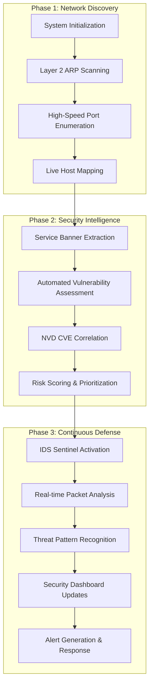

# **🛡️ VIGIL v1.5: Advanced Network Reconnaissance & Security Sentinel**

### **Virtual Interface for Gateway Inspection & Listening** VIGIL is a comprehensive security assessment suite engineered for enterprise-grade network visibility and real-time threat intelligence. Leveraging a high-concurrency architecture and an intuitive Terminal User Interface (TUI), VIGIL seamlessly integrates active reconnaissance capabilities with passive intrusion monitoring to deliver unparalleled security insights.

[Version](https://img.shields.io/badge/Version-1.5-0078D4?style=for-the-badge&logo=github)

[Python](https://img.shields.io/badge/Python-3.10+-3776AB?style=for-the-badge&logo=python)

[License](https://img.shields.io/badge/License-MIT-4CAF50?style=for-the-badge)

[Interface](https://img.shields.io/badge/UI-Interactive_TUI-FF69B4?style=for-the-badge)

[Contributors](https://img.shields.io/github/contributors/muhzahidazmy/VIGIL?style=for-the-badge)

[Issues](https://img.shields.io/github/issues/muhzahidazmy/VIGIL?style=for-the-badge)

---

## **🏗️ System Architecture & Operational Workflow**

VIGIL implements a systematic security methodology that progresses through three distinct phases: discovery, intelligence gathering, and persistent defense monitoring.



---

## **🔧 Core Capabilities & Architecture**

### **🎯 Mission-Critical Features**

### **🔍 Advanced Reconnaissance Engine**

VIGIL employs a sophisticated **multi-threaded asynchronous architecture** to deliver comprehensive attack surface mapping with minimal latency.

- **Layer 2 Network Discovery**: Utilizes ARP requests to identify active hosts, effectively bypassing traditional Layer 3 ICMP/Ping restrictions
- **Real-time Data Streaming**: Implements live row population to eliminate scanning delays and provide immediate visibility
- **Hardware Intelligence**: Automatically correlates MAC addresses with our comprehensive database of 20,000+ manufacturer OUI identifiers

### **🧠 Intelligent Security Analytics**

Beyond simple port discovery, VIGIL performs comprehensive security audits on identified services.

- **Service Enumeration**: Advanced banner grabbing protocols for HTTP/S, SSH, and other services to extract precise version information
- **Vulnerability Intelligence**: Direct integration with the **National Vulnerability Database (NVD)** for immediate CVE correlation and risk assessment
- **Automated Security Posture Assessment**: Implements heuristic analysis across all discovered services:
    - **HTTP Security Headers**: Validates critical security headers including HSTS, CSP, X-Frame-Options, and more
    - **TLS/SSL Configuration**: Analyzes cryptographic protocols, identifying deprecated versions (TLS 1.0/1.1) and certificate validity issues

### **🛡️ Real-time Intrusion Detection**

A sophisticated, high-performance **Intrusion Detection System (IDS)** providing continuous threat monitoring.

- **SYN Flood Detection**: Identifies high-volume connection attempts using rolling 10-second analysis windows
- **Multi-Protocol Flood Protection**: Specialized detection signatures for UDP and ICMP flooding attacks
- **ARP Security Monitoring**: Detects ARP cache poisoning attempts and suspicious MAC address redirections
- **Behavioral Anomaly Detection**: Advanced pattern recognition for identifying sequential port scanning and reconnaissance activities

---

## **Quick Start Guide**

VIGIL is engineered for rapid deployment with minimal configuration requirements.

> ⚠️ **System Requirements**: Raw packet operations require elevated privileges (Root/Administrator) for optimal functionality.
> 

### **Prerequisites Installation**

### **Network Driver Configuration**

VIGIL requires low-level network access capabilities:

- **Windows**: Install [Npcap](https://nmap.org/npcap/) with WinPcap API compatibility mode
- **Linux**: Install libpcap development package (`sudo apt install libpcap-dev`)
- **macOS**: Install libpcap via Homebrew (`brew install libpcap`)

### **Python Dependencies**

```bash
pip install scapy nvdlib rich colorama
```

**Alternative Installation Methods:**

```bash
# Using requirements file
pip install -r requirements.txt

# Development installation
pip install -e .
```

### **Initial Security Assessment**

### **Network Discovery**

```bash
# Comprehensive host discovery
python vigil.py --discover 192.168.1.0/24 --save-results

# Targeted reconnaissance
python vigil.py -t 192.168.1.10 -p 1-1000 --verbose --cve-check
```

### **Real-time Threat Monitoring**

```bash
# Activate IDS monitoring mode
python vigil.py --vigilant -i "Ethernet" --alert-threshold 10

# Custom monitoring configuration
python vigil.py --vigilant --interface "Wi-Fi" --bpf "tcp and port 443" --log-file security.log
```

---

## **📋 Command Line Interface Reference**

### **Core Operations**

| Parameter | Short Flag | Default Value | Description |
| --- | --- | --- | --- |
| `--target` | `-t` | `None` | Target specification (IP, hostname, or URL) |
| `--ports` | `-p` | `1-65535` | Port specification (comma-separated or ranges) |
| `--threads` | `-w` | `100` | Concurrent scanning threads |
| `--timeout` | N/A | `0.5s` | Connection timeout in seconds |
| `--fast` | N/A | `False` | Optimized scanning mode (3x faster) |
| `--vigilant` | `-v` | `False` | Activate IDS monitoring mode |
| `--bpf` | N/A | `None` | Custom Berkeley Packet Filter expression |

### **Advanced Options**

| Parameter | Default | Description |
| --- | --- | --- |
| `--interface` | Auto-detect | Network interface for packet capture |
| `--output` | `None` | Output file for results |
| `--format` | `json` | Output format (json, csv, xml) |
| `--cve-check` | `True` | Enable CVE vulnerability assessment |
| `--verbose` | `False` | Detailed output and logging |

---

## **📚 Technical Documentation**

### **Security Terminology**

| Acronym | Domain | Definition |
| --- | --- | --- |
| **ARP** | Network Layer | Address Resolution Protocol - maps IP addresses to MAC addresses |
| **BPF** | Packet Filtering | Berkeley Packet Filter - kernel-level packet filtering syntax |
| **CVE** | Vulnerability Management | Common Vulnerabilities and Exposures - public security flaw database |
| **IDS** | Security Monitoring | Intrusion Detection System - real-time threat monitoring |
| **OUI** | Hardware Identification | Organizationally Unique Identifier - MAC address manufacturer codes |

### **Security Headers Reference**

| Header | Purpose | Security Impact |
| --- | --- | --- |
| **HSTS** | HTTP Strict Transport Security | Enforces HTTPS connections |
| **CSP** | Content Security Policy | Prevents XSS attacks |
| **XFO** | X-Frame-Options | Mitigates clickjacking |
| **X-Content-Type-Options** | MIME type protection | Prevents MIME sniffing attacks |

---

## **🔧 Performance Optimization & Troubleshooting**

### **Common Resolution Strategies**

### **CVE Data Unavailable**

**Issue**: CVE column appears empty during scans **Solution**:

- Verify NVD API accessibility and rate limits
- Enable verbose mode (`-verbose`) for banner grabbing diagnostics
- Check network connectivity to NVD servers

### **Scanning Performance Issues**

**Issue**: Slow or incomplete scanning progress **Resolution**:

```bash
# Increase timeout for high-latency networks
python vigil.py -t target.com --timeout 2.0

# Reduce thread count for stability
python vigil.py -t target.com --threads 50

# Use fast mode for large networks
python vigil.py -t target.com --fast
```

---

## **⚖️ Legal & Ethical Compliance**

### **Authorized Use Policy**

VIGIL is distributed exclusively for **authorized security testing, research, and educational purposes**. Users must comply with all applicable laws and regulations.

**Usage Requirements:**

- Obtain explicit written permission before conducting security assessments
- Ensure compliance with organizational security policies
- Adhere to regional and international cybersecurity laws

### **Liability Disclaimer**

The developers and maintainers of VIGIL assume no responsibility for misuse, unauthorized access, or legal consequences resulting from improper deployment of this software.

---

## **🤝 Contributing & Support**

### **Project Information**

- **Maintainer**: [muhzahidazmy](https://github.com/muhzahidazmy)
- **License**: [MIT License](https://file+.vscode-resource.vscode-cdn.net/f%3A/Cyber%20Security%20Project/vigil/LICENSE)
- **Repository**: [GitHub Project](https://github.com/muhzahidazmy/VIGIL)

### **Community & Support**

- **Issues**: [Bug Reports & Feature Requests](https://github.com/muhzahidazmy/VIGIL/issues)
- **Discussions**: [Community Forum](https://github.com/muhzahidazmy/VIGIL/discussions)
- **Documentation**: [Wiki](https://github.com/muhzahidazmy/VIGIL/wiki)

### **Contribution Guidelines**

We welcome contributions from the security community. Please review our contribution guidelines and submit pull requests for enhancements and bug fixes.

---

**VIGIL - Empowering Security Professionals with Advanced Network Intelligence**
